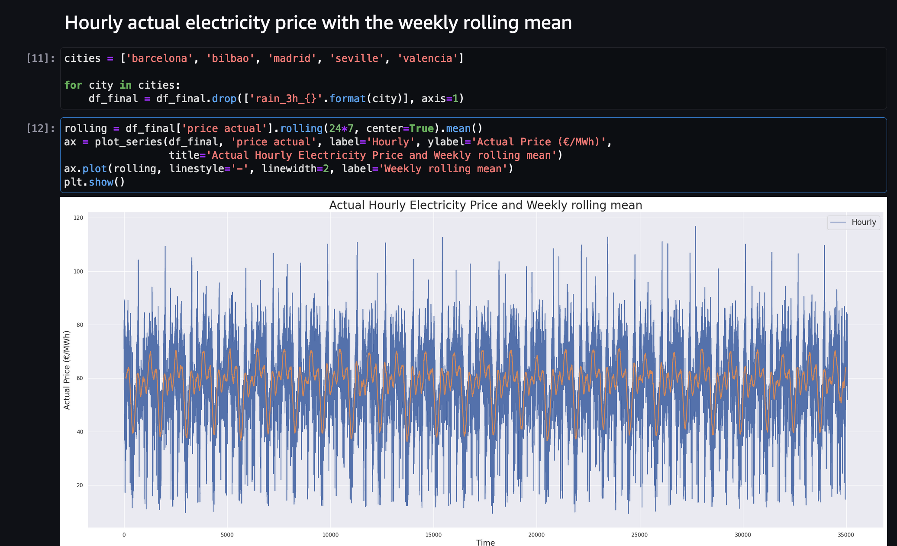
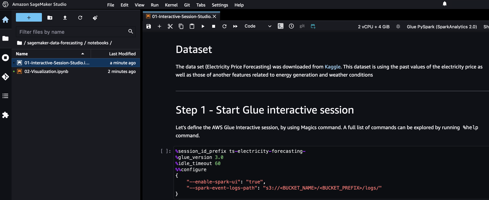
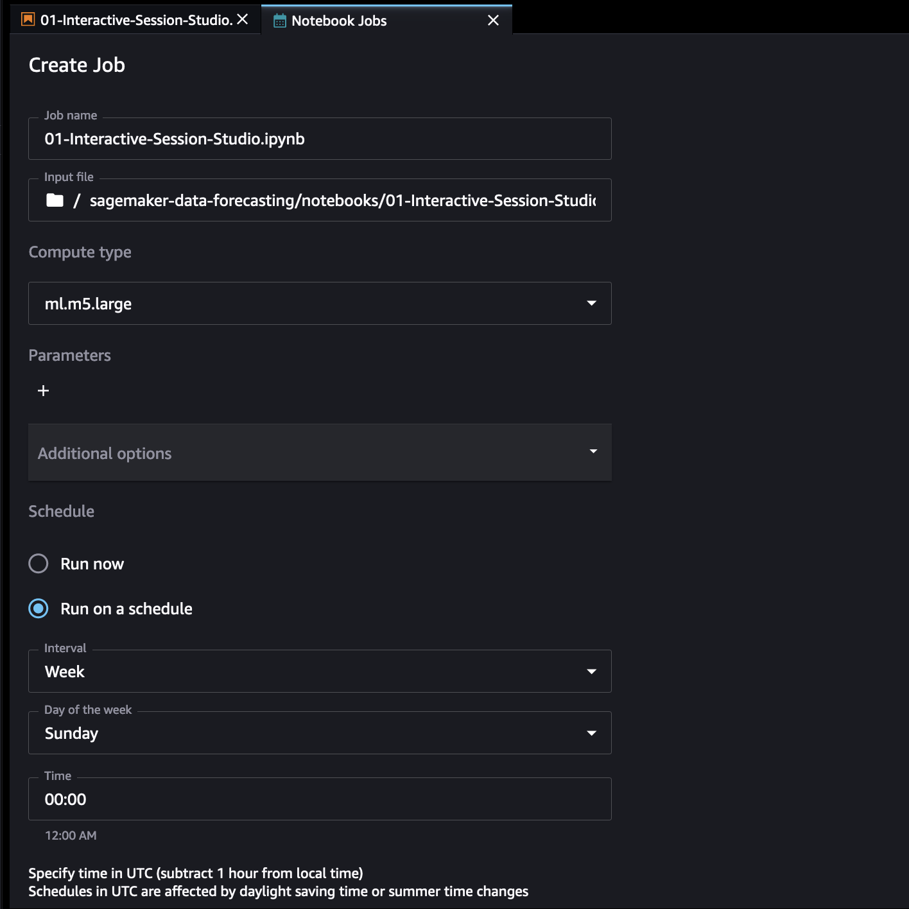

# Forecast Analysis with SageMaker Studio Interactive Session and Notebook Jobs

In this example we will go through the steps required for easily create visualization reports using Amazon SageMaker Studio Notebooks on a scheduled base, by using the capabilities of Interactive Data Processing and Notebook Jobs.

The example dataset is based on the Electricity Forecasting dataset taken from [Kaggle](https://www.kaggle.com/code/dimitriosroussis/electricity-price-forecasting-with-dnns-eda/data).

In this repo, we will show you:

1. How perform distributed data processing by using PySpark in [Studio Notebooks with Glue Interactive Session](https://docs.aws.amazon.com/glue/latest/dg/interactive-sessions-sagemaker.html)
2. Create scheduled executions of the notebook by using [SageMaker Scheduled Notebook Job](https://docs.aws.amazon.com/sagemaker/latest/dg/create-notebook-auto-run.html) for creating weekly feature and insight extractions directly by using the notebbok
3. Visualize results and reports in a SageMaker Studio Notebook

## Screenshots

<table style="{border: none; text-align: center;}" width="70%">
    <tr>
        <td colspan="2"></td>
    </tr>
    <tr>
        <td></td>
        <td></td>
    </tr>
</table>